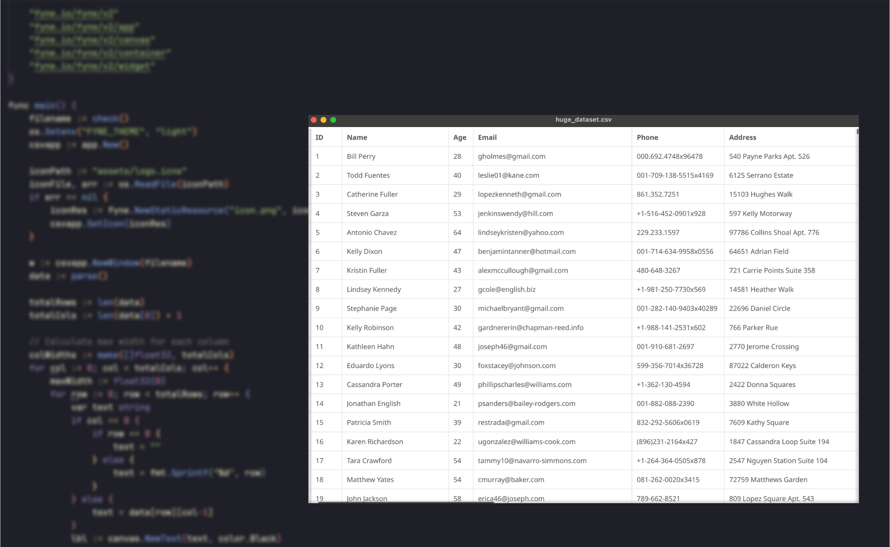

# GCSV 

A lightweight, cross-platform CSV viewer with a modern GUI built in Go using [Fyne ToolKit](https://fyne.io/).


---

## Preview

> _What GCSV looks like in action:_

  
<!-- Replace with an actual screenshot or animated GIF -->

---


##  Requirements

- Go 1.20+
- OS: Windows, macOS, or Linux


## Installation

```bash
git clone https://github.com/Pengw0in/gcsv.git
cd gcsv
go mod tidy
```

## Usage

### Quick Start (Run directly)

```bash
go run . yourfile.csv
```

### Build and Run

```bash
go build -o gcsv
./gcsv yourfile.csv
```


##  Dependencies

- [Fyne](https://fyne.io/) — Cross-platform GUI toolkit for Go

##  Contributing

Contributions are welcome!  
Feel free to open issues or submit pull requests — improvements, fixes, and new features are all appreciated.
